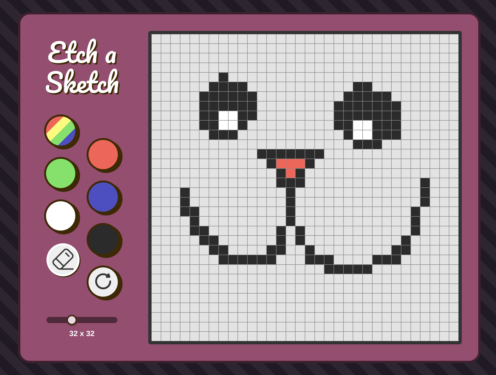

# Etch-a-Sketch

Live Preview: https://angieaugy.github.io/etch-a-sketch/

A browser based Etch-a-Sketch built with Javascript, HTML and CSS. Draw with your cursor! No mobile functionality at the moment.

## Challenges

> Issues with Mouse when Drawing

When the drawing logic was created, it worked well enough, but occasionally it would stop coloring the grids. The cursor would change to a not-allowed symbol and it took me a long time to figure out what was triggering it. 

After some digging around, I guessed it was most likely caused by a click and drag event, but I was unsure about how to disable it. I tried toggling `<draggable>` to false on the relevant HTML elements, but that didn't work.

It was only after I found mention of the `user-select` property (where it controls whether a user can select text) in CSS that I was able to fix this issue.

> Retrieving Information that is Passed in `AddEventListener`

I am still struggling with this. Depending on how the function is written in the listener parameter, it affects whether I have access to `this`. If I can't access it, then I struggle with trying to retrieve the information I need. Can I add multiple functions to one event listener, or should I use multiple event listeners for one element? I'm unsure of when to use one or the other. My event listeners work now, but it was more through a process of trial and error, than truly understanding how values are being passed down for each situation.

> Writing Redundant Code

There a were a few times I caught myself pulling values from HTML elements and rewriting them when assigning them to variables in Javascript. For one instance, I had created a really long `switch` statement when reassigning values to `penstate` in `switchPenState()`. After a review, I realised I should take advantage of `this.value`. 

## Thoughts

Initially I thought that scripting the grid creation logic would take some time, but I finished it quite quickly. I spent most of my time working out the pen state logic and having it reflected through toggled button states in the DOM. And of course, styling everything as well. 

In summary, this was a great exercise at reviewing what I've learned about manipulating the HTML elements through Javascript. I can see myself using methods like adding and removing classes quite extensively. There were also little things I've learned to note like how `getElementsByClassName` does not return an Array, Map or Set so looping it with `forEach` will not work. It has to be converted into an Array with `Array.from` before we can loop it.

Looking forward to the next project!

## Attributions

  <a href="https://www.flaticon.com/free-icons/eraser" title="eraser icons">Eraser icon created by Iconjam - Flaticon</a>

  <a href="https://www.flaticon.com/free-icons/reset" title="reset icons">Reset icon created by inkubators - Flaticon</a>
